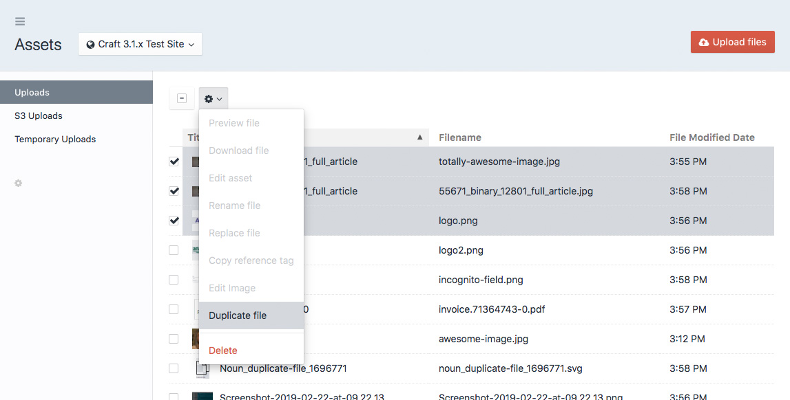

# Duplicate File plugin for Craft CMS 3.x

Adds a _Duplicate File_ Element Action. 

## Requirements

This plugin requires Craft CMS 3.1.0 or later.

## Installation

To install the plugin, follow these instructions.

1. Open your terminal and go to your Craft project:

        cd /path/to/project

2. Then tell Composer to load the plugin:

        composer require mmikkel/duplicate-file

3. In the Control Panel, go to Settings → Plugins and click the “Install” button for Duplicate File.
